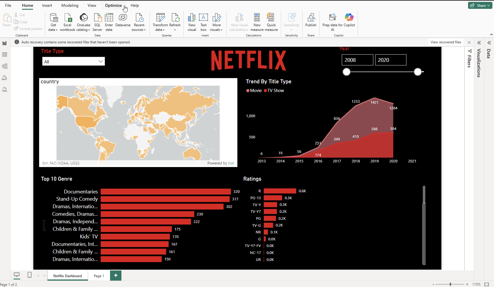

# 🎬 Netflix Power BI Dashboard

A data analytics project that explores Netflix movies and TV shows using **Microsoft Power BI**.
This dashboard helps visualize trends in genres, ratings, countries, and content growth over time.

---

## 📊 Dashboard Preview

---

## 📌 Project Overview

The objective of this project is to analyze Netflix content data and create an **interactive dashboard** that provides insights into the platform's content distribution.

The dashboard answers important questions such as:

* Which genres are most common on Netflix?
* How are movies and TV shows rated?
* Which countries produce the most Netflix content?
* How has Netflix content grown over the years?

---

## 📈 Key Insights

* **Documentaries and Stand-Up Comedy** are among the most frequent genres.
* The majority of Netflix content comes from the **United States**.
* A significant growth in Netflix content occurred after **2016**.
* Movies are more common than TV Shows in the dataset.

---

## 🛠 Tools & Technologies Used

* Microsoft Power BI
* Data Visualization
* Data Analytics
* Netflix Dataset (CSV)

---

## 📂 Project Files

| File Name                      | Description               |
| ------------------------------ | ------------------------- |
| Netflix Dashboardsujal.pbix    | Power BI dashboard file   |
| netflix_titles.csv             | Dataset used for analysis |
| Netflix.png                    | Dashboard preview image   |
| Sujal_Giri_PowerBI_Project.pdf | Project report            |

---

## ⚙️ Dashboard Features

The dashboard includes the following visualizations:

* 🌍 Country-wise content distribution (Map)
* 📊 Top 10 Netflix genres
* 📉 Ratings distribution
* 📅 Yearly trend of Netflix movies and TV shows
* 🎯 Title type filter (Movies / TV Shows)

These visuals help users explore Netflix data interactively.

---

## 📷 Dataset Information

The dataset includes the following fields:

* Title
* Type (Movie / TV Show)
* Director
* Country
* Date Added
* Release Year
* Rating
* Duration
* Genre
* Description

---

## 🎯 Project Result

This project demonstrates how **Power BI dashboards** can be used to transform raw data into meaningful insights using data visualization techniques.

---

## 👨‍💻 Author

**Sujal Giri**
BTech Computer Science Engineering
Shambhunath Institute of Engineering & Technology

---

## ⭐ Support

If you found this project useful, please consider **starring ⭐ the repository**.

